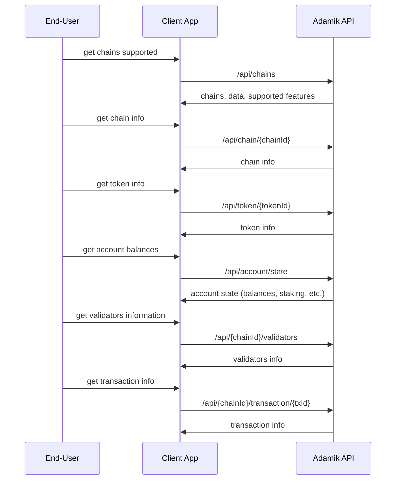

The diagram below outlines the basic flow of interactions between the app, the user, and the Adamik API.

## Read API Overview

The **Read API** allows users to retrieve key information related to blockchain networks, tokens, account data, and transaction history. These endpoints provide essential data that can help users track assets, get insights into chain activity, and monitor validator status.

- **Get Chains Supported** (`GET /api/chains`): Retrieve a list of supported chains and available features.
- **Get Chain Info** (`GET /api/chain/{chainId}`): Fetch details about a specific blockchain, such as its supported tokens and network information.
- **Get Token Info** (`GET /api/token/{tokenId}`): Get details about specific tokens on the chain, such as decimals and contract addresses.
- **Get Account State (Balances)** (`POST /api/account/state`): Retrieve the account's current state, including balances, staking positions, and rewards.
- **Get Validators Information** (`POST /api/{chainId}/validators`): Retrieve information about the current staking validators for the selected chain.
- **Get Transaction Info** (`GET /api/{chainId}/transaction/{txId}`): Get details on a specific transaction, including status, history, and block confirmations.

<Info>
  **Note**: These endpoints form the core of the Read API, enabling applications
  to fetch the necessary on-chain information without needing access to private
  keys. Importantly, the responses from the API are **always standardized**
  across all supported networks, ensuring a unified, consistent format
  regardless of the blockchain being accessed.
</Info>
