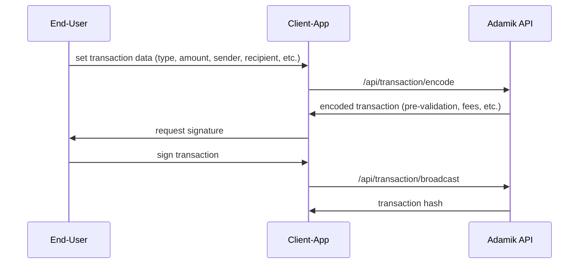

The diagram below outlines the specific flow for encoding and broadcasting transactions between the app, the user, and the Adamik API.

This diagram simplifies the process into two main steps:

1. **Transaction Encoding**: The app sends transaction basic details (intent) to the Adamik API, which returns an encoded transaction ready for signing.
2. **Transaction Broadcasting**: After the user signs the transaction, the app sends the signature back to the Adamik API for broadcasting to the blockchain.

<Info>
  **Note**: The `/api/transaction/encode` and `/api/transaction/broadcast`
  endpoints accept the same inputs across all networks.
</Info>

### `/api/transaction/encode` Endpoint Overview

The `/api/transaction/encode` endpoint is designed to streamline the process of creating and preparing blockchain transactions. It serves as an all-in-one solution that validates, completes, and encodes transactions ready for signing. Here’s how it works:

#### Key Functions:

1. **Input Validation**  
   The endpoint checks that all required fields are provided and flags any inconsistencies. For example, it ensures that incompatible fields like `amount` and `useMaxAmount` are not used together. The system also verifies that the sender’s account has enough balance to cover both the transaction amount and the fees.

2. **Automatic Fee & Gas Calculation**  
   One of the key benefits of this endpoint is that it automatically calculates the necessary transaction fees and gas estimates. There's no need to input these manually, as the system computes them based on network conditions.

3. **Transaction Completion**  
   It computes the final transaction details, such as adjusting the amount when `useMaxAmount` is specified, or setting the nonce when applicable.

4. **Custom Chain Rule Validation**  
   The endpoint applies specific validation rules based on the blockchain network. This ensures that the transaction complies with the unique requirements of each supported chain.

5. **Raw Transaction Encoding**  
   Finally, the completed transaction is encoded into a raw payload that is ready for signing by the user’s wallet.

### Why Leverage the `/api/transaction/encode` Endpoint?

The `/api/transaction/encode` endpoint offers a streamlined, one-stop solution for handling the complexities of blockchain transactions. By leveraging this endpoint, developers can:

- **Save Time**: With built-in validation, fee estimation, and gas calculation, you no longer need to manage these aspects manually. The API handles the heavy lifting, letting you focus on building your application.
- **Reduce Errors**: The endpoint ensures your transactions are correctly formatted and validated according to custom chain rules, minimizing the risk of issues like insufficient fees or invalid transactions.
- **Simplify Development**: Instead of juggling multiple endpoints for transaction creation, fee management, and encoding, you can rely on this single endpoint to manage the entire process from user input to the final transaction payload.
- **Increase Reliability**: The API checks that your transactions are not only valid but also executable by confirming the sender has enough balance for the transaction amount and fees.

By automating key steps in the transaction process, the `/api/transaction/encode` endpoint aligns with Adamik's goal to deliver a **developer-first** experience, offering efficiency, simplicity, and reliability in blockchain integration.

For full implementation details, refer to [`/api/transaction/encode`](../api-reference/endpoint/post-apitransactionencode).
