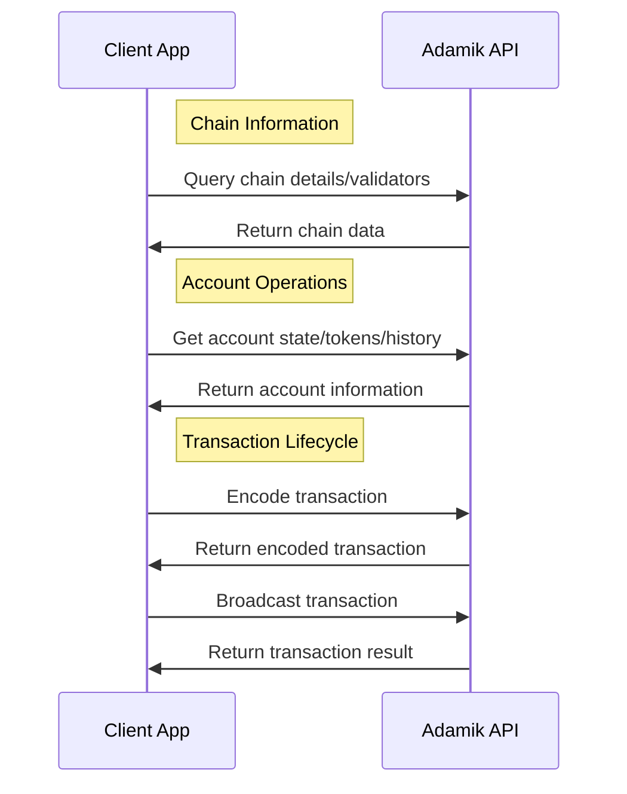

Before exploring the detailed specifications and API references, review these high-level principles for an overview of the API's capabilities and workflow.

## API Categories

The Adamik API is organized into four main categories:

- **Chain**: Query blockchain network information and validators
- **Address**: Handle address encoding and validation
- **Account**: Retrieve account states, balances, and history
- **Transaction**: Manage transaction lifecycle from encoding to broadcasting

<CardGroup cols={2}>
  <Card
    title="Chain & Address APIs"
    icon="link"
    href="../api-reference/current/chain/get-supported-chains"
  >
    Query network information and manage address operations
  </Card>
  <Card
    title="Account & Transaction APIs"
    icon="wallet"
    href="../api-reference/current/account/get-account-state"
  >
    Handle account queries and transaction operations
  </Card>
</CardGroup>

<Info>
  Note that our APIs are fully stateless and do not require access to private
  keys.
</Info>
