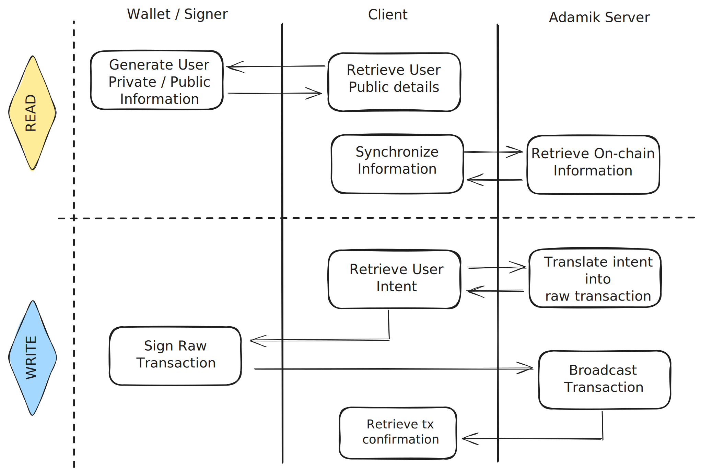

Before delving into the detailed specifications and API references, it's recommended to review the high-level principles below. This preliminary step aims to provide a comprehensive understanding of the APIs' capabilities and operational dynamics.

## Flow of operations

The Adamik API operates on a client/server model. 
Your application handles interfacing with wallet signers and capturing user intents, while Adamik servers manage on-chain data retrieval and transaction engineering (crafting).

## Read and Write APIs

The Adamik APIs are segregated into two principal categories: 
- the **Read API** for data retrieval and the **Write API** for transaction management. Both APIs are standardized across a wide range of blockchain networks.
- Beyond the core APIs, Adamik extends its functionality through the **Utility API** which provides tools for various operational needs, such as address format validation, transaction fee estimation, and network congestion assessment.

<CardGroup cols={3}>
  <Card
    title="Read API"
    icon="readme"
    href="../api-reference/endpoint/get-apichains"
  >
The Read API facilitates easy access to on-chain information.
</Card>
  <Card
    title="Write API"
    icon="pen-to-square"
    href="../api-reference/endpoint/post-apitransactionencode"
  >
The Write API supports simple cryptocurrency transfers, delegations, and smart contract interactions.

  </Card>
  <Card
    title="Utility API"
    icon="gear"
    href="../api-reference/endpoint/post-apiaddressencode"
  >
The Utility API provides tools to aid crypto application development.
</Card>
</CardGroup>

<Info>
  Note that our API are fully stateless and operates without requiring access to private keys.
</Info>

