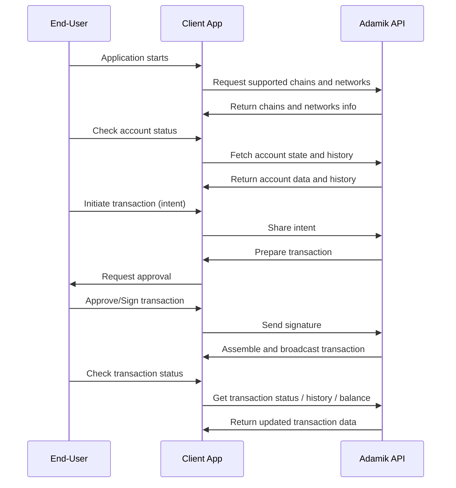

Before exploring the detailed specifications and API references, review these high-level principles for an overview of the API’s capabilities and workflow.

## Flow of operations

The Adamik API operates on a client/server model. Your application captures user intents and has signing capabilities. The Adamik server manages on-chain data retrieval and transaction crafting, ensuring that user intents are properly translated and executed on the blockchain.

The diagram below outlines the basic flow of interactions between the app, the user, and the Adamik API.

## Read and Write APIs

The Adamik APIs are divided into two principal categories:

- **Read API**: For data retrieval, including fetching account details and transaction history.
- **Write API**: For managing transactions such as cryptocurrency transfers or staking operations.

These APIs work consistently across various blockchain networks.

In addition to the core APIs, Adamik offers the **Utility API** to support common operational needs. It includes tools for address format validation, or pubkey conversion to addresses, helping to streamline crypto application development.

<CardGroup cols={3}>
  <Card
    title="Read API"
    icon="readme"
    href="../api-reference/read_API_overview_and_interaction_flow"
  >
    Retrieve on-chain information with ease using the Read API.
  </Card>
  <Card
    title="Write API"
    icon="pen-to-square"
    href="../api-reference/write_API_overview_and_interaction_flow"
  >
    Manage cryptocurrency transfers and delegations with the Write API.
  </Card>
  <Card
    title="Utility API"
    icon="gear"
    href="../api-reference/endpoint/post-apiaddressencode"
  >
    Leverage tools like address format validation with the Utility API.
  </Card>
</CardGroup>

<Info>
  Note that our APIs are fully stateless and do not require access to private
  keys.
</Info>
